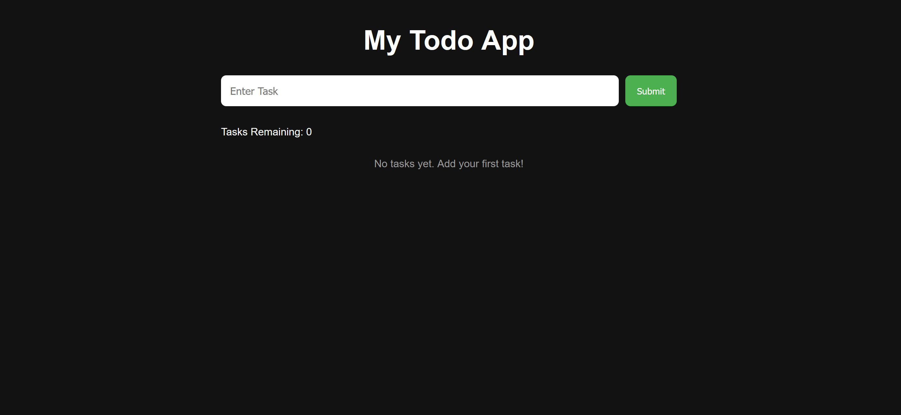
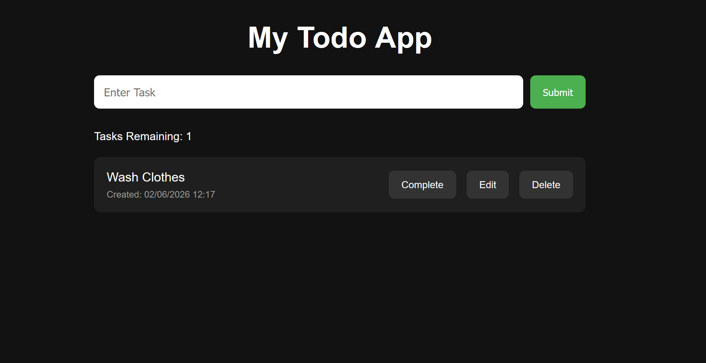
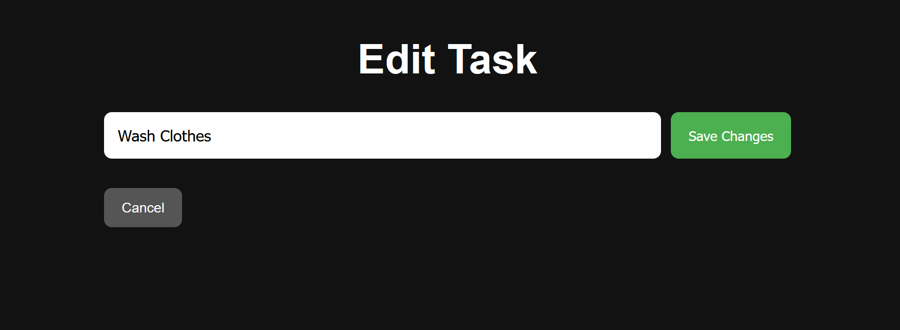
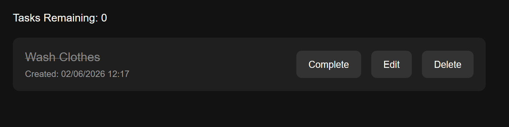

# Flask Todo App

A full-stack task management application built with Flask, Flask-SQLAlchemy and SQLite.

Users can create, edit, complete and delete tasks through a clean and responsive interface. Tasks are stored in a SQLite database, allowing data to persist between application restarts.

---

## Features

* Create new tasks
* Edit existing tasks
* Mark tasks as complete/incomplete
* Delete tasks
* View task creation date and time
* Track remaining tasks
* Tasks ordered by newest first
* Persistent SQLite database storage
* Responsive and modern user interface

---

## Screenshots

### Home Page



### Creating a Task



### Editing a Task



### Completed Task



---

## Technologies Used

### Backend

* Python 3
* Flask
* Flask-SQLAlchemy
* SQLite

### Frontend

* HTML5
* CSS3
* Jinja2 Templates

### Development Tools

* Git
* GitHub
* VS Code

---

## Project Structure

```text
to-do-app/
│
├── static/
│   └── css/
│       └── style.css
│
├── templates/
│   ├── base.html
│   ├── edit.html
│   └── index.html
│
├── app.py
├── requirements.txt
├── README.md
└── .gitignore
```

---

## Features Demonstrated

### CRUD Operations

#### Create

Users can add new tasks using the task input form.

#### Read

All tasks are displayed dynamically from the SQLite database.

#### Update

Users can:

* Edit task text
* Mark tasks as complete/incomplete

#### Delete

Users can remove tasks permanently.

---

## Database

The application uses SQLite and Flask-SQLAlchemy.

### Task Model

Each task contains:

| Field      | Type     | Description             |
| ---------- | -------- | ----------------------- |
| id         | Integer  | Unique task ID          |
| text       | String   | Task description        |
| completed  | Boolean  | Completion status       |
| created_at | DateTime | Task creation timestamp |

---

## Installation

### Clone the repository

```bash
git clone https://github.com/HReid17/flask-todo-app.git
```

### Navigate into the project directory

```bash
cd flask-todo-app
```

### Create a virtual environment

```bash
python -m venv .venv
```

### Activate the virtual environment

Git Bash:

```bash
source .venv/Scripts/activate
```

Windows Command Prompt:

```bash
.venv\Scripts\activate
```

### Install dependencies

```bash
pip install -r requirements.txt
```

---

## Running the Application

Start the Flask server:

```bash
python app.py
```

Open your browser and visit:

```text
http://127.0.0.1:5000
```

---

## Learning Outcomes

This project was built as part of my backend development journey and demonstrates understanding of:

* Python fundamentals
* Object-Oriented Programming (OOP)
* Flask routing
* Forms and POST requests
* Jinja templating
* Template inheritance
* Dynamic rendering
* SQLAlchemy ORM
* SQLite databases
* CRUD operations
* Git and GitHub workflows

---

## Future Improvements

Potential future enhancements include:

* User authentication
* Task categories
* Task priorities
* Due dates
* Search functionality
* Pagination
* REST API integration
* Dark/Light theme toggle

---

## Author

**Harrison Reid**

Aspiring Software Engineer with a background in Digital Marketing and a passion for building full-stack web applications.

GitHub: https://github.com/HReid17

```
```
